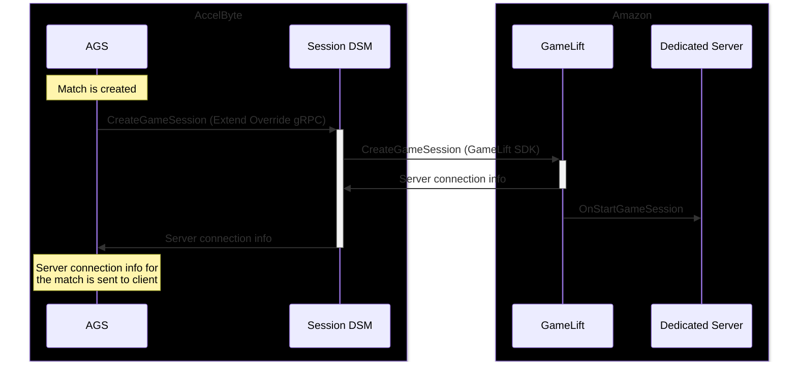
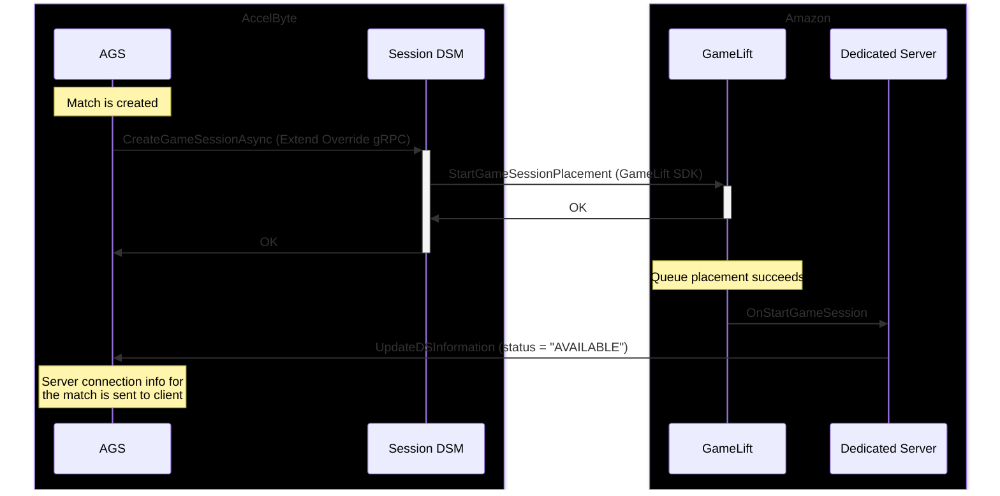

# Session DSM Extend Override for GameLift Servers

**AccelByte Gaming Services** (AGS) features can be customized using **Extend** services, which are backend gRPC servers that can be written by developers to customize AGS functionality. The **Session DSM Extend Override** is a service used to request servers to back AccelByte Game Sessions. Developers can customize the Session DSM to support other hosting providers including, GameLift Servers.

> [!NOTE]  
> This README serves as a supplement to the README in [the standard Session DSM Extend Override template](https://github.com/AccelByte/session-dsm-grpc-plugin-go), providing more information about the GameLift Servers integration and how you can integrate it within your own project.

## Overview

The Session DSM has three overridable functions: `CreateGameSession`, `CreateGameSessionAsync`, and `TerminateGameSession`. In this project, these functions are implemented to manage servers through GameLift Servers using [the official AWS SDK for Go v2](https://pkg.go.dev/github.com/aws/aws-sdk-go-v2).

- `CreateGameSession` creates a GameLift Game Session using the AWS SDK function `CreateGameSession` and immediately returns server connection details on success. This is the default behavior of the Session DSM, and is useful for testing or for games that may not require the power and flexibility of GameLift Queues
- `CreateGameSessionAsync` starts a GameLift session queue placement using the AWS SDK function `StartGameSessionPlacement`. This is used when running the Session DSM in **asynchronous mode**, and is used to leverage GameLift Queues.
- `TerminateGameSession` will terminate an existing GameLift Game Session using the AWS SDK function `TerminateGameSession`. This is used for sessions that are created by both `CreateGameSession` and `CreateGameSessionAsync`.

### Synchronous vs Asynchronous Mode

There are two distinct methods that can be used to request servers from GameLift Servers, referred to as **synchronous mode** and **asynchronous mode**. This toggle is handled in the Session DSM, and can be set for specific AccelByte Session Templates as needed.

**Synchronous mode** is simpler to implement, and is best used for early testing and development workflows. This method also gives developers explicit control over what fleets are used when a session is created.

The following sequence diagram depicts the normal flow when operating the Session DSM in synchronous mode. This is the default behavior, and the flow used by the quickstart guide.

**Asynchronous mode** allows developers to utilize GameLift Server Queues for session placement, which allows placing sessions to optimize by latency, cost, and location. Using Queues offers an easy and efficient way to process high volumes of session placement requests across multiple regions. This mode is recommended for production workloads.

When using asynchronous mode and a session placement succeeds, the flow is similar to the synchronous flow, but the dedicated server makes the call to AccelByte through UpdateDSInformation to provide connection details and update the server status to "AVAILABLE".

## Quickstart

AccelByte provides a command-line utility that can be used to create, upload, and manage Extend apps. For more information, refer to the the official AccelByte documentation: [Get started with session Dedicated Server customization](https://docs.accelbyte.io/gaming-services/services/extend/override/getting-started-with-session-customization-server-dsm/#upload-the-extend-app).

A helper script using the `extend-helper-cli` is located in the Session DSM repo that will create, configure, build, upload and deploy the Session DSM. Modify and run the script in `scripts/create_session_dsm.sh` to create and configure the Session DSM.

## Additional Resources

This repository is based on the standard AccelByte Session DSM template: [AccelByte/session-dsm-grpc-plugin-go](https://github.com/AccelByte/session-dsm-grpc-plugin-go)

For more information about the Extend system and the Session DSM extension, refer to the following resources:

- [Getting Started with Session Dedicated Server Customization](https://docs.accelbyte.io/gaming-services/services/extend/override/getting-started-with-session-customization-server-dsm/)
- [Introduction to External Dedicated Game Server Management with Session Override](https://docs.accelbyte.io/gaming-services/services/extend/override/session-dsm-function/)

The following functions in the AWS Golang SDK are used in this implementation of the Session DSM:

- [aws-sdk-go-v2 - CreateGameSession](https://pkg.go.dev/github.com/aws/aws-sdk-go-v2/service/gamelift#Client.CreateGameSession)
- [aws-sdk-go-v2 - StartGameSessionPlacement](https://pkg.go.dev/github.com/aws/aws-sdk-go-v2/service/gamelift#Client.StartGameSessionPlacement)
- [aws-sdk-go-v2 - TerminateGameSession](https://pkg.go.dev/github.com/aws/aws-sdk-go-v2/service/gamelift#Client.TerminateGameSession)
