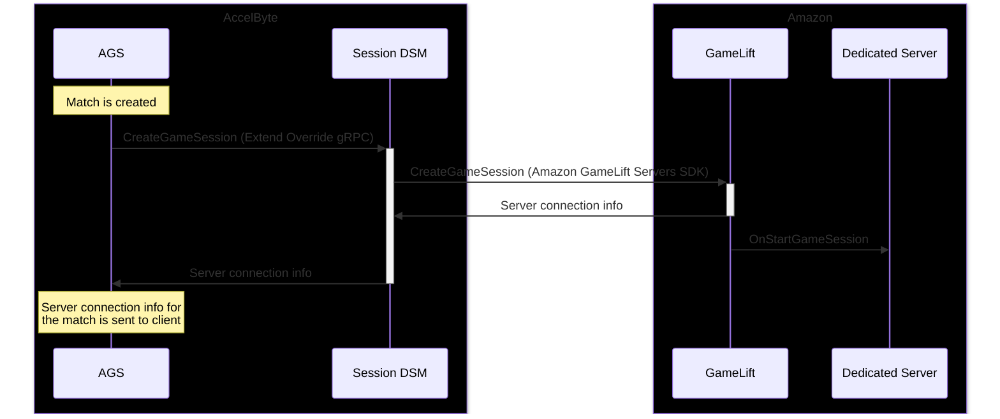
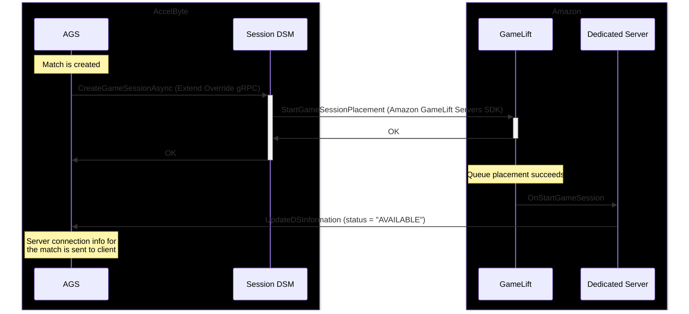

# Session DSM Extend Override for Amazon GameLift Servers

**AccelByte Gaming Services** (AGS) features can be customized using **Extend** services, which are backend gRPC servers that can be written by developers to customize AGS functionality. The **Session DSM Extend Override** is a service used to request servers to back AccelByte Game Sessions. Developers can customize the Session DSM to support other hosting providers including, Amazon GameLift Servers.

## Overview

The Session DSM has three overridable functions: `CreateGameSession`, `CreateGameSessionAsync`, and `TerminateGameSession`. In this project, these functions are implemented to manage servers through Amazon GameLift Servers using [the official AWS SDK for Go v2](https://pkg.go.dev/github.com/aws/aws-sdk-go-v2).

- `CreateGameSession` creates a Amazon GameLift Game Session using the AWS SDK function `CreateGameSession` and immediately returns server connection details on success. This is the default behavior of the Session DSM, and is useful for testing or for games that may not require the power and flexibility of Amazon GameLift Queues
- `CreateGameSessionAsync` starts a Amazon GameLift session queue placement using the AWS SDK function `StartGameSessionPlacement`. This is used when running the Session DSM in **asynchronous mode**, and is used to leverage Amazon GameLift Queues.
- `TerminateGameSession` will terminate an existing Amazon GameLift Game Session using the AWS SDK function `TerminateGameSession`. This is used for sessions that are created by both `CreateGameSession` and `CreateGameSessionAsync`.

### Synchronous vs Asynchronous Mode

There are two distinct methods that can be used to request servers from Amazon GameLift Servers, referred to as **synchronous mode** and **asynchronous mode**. This toggle is handled in the Session DSM, and can be set for specific AccelByte Session Templates as needed.

**Synchronous mode** is simpler to implement, and is best used for early testing and development workflows. This method also gives developers explicit control over what fleets are used when a session is created.

The following sequence diagram depicts the normal flow when operating the Session DSM in synchronous mode. This is the default behavior, and the flow used by the quickstart guide.

**Asynchronous mode** allows developers to utilize Amazon GameLift Server Queues for session placement, which allows placing sessions to optimize by latency, cost, and location. Using Queues offers an easy and efficient way to process high volumes of session placement requests across multiple regions. This mode is recommended for production workloads.

When using asynchronous mode and a session placement succeeds, the flow is similar to the synchronous flow, but the dedicated server makes the call to AccelByte through UpdateDSInformation to provide connection details and update the server status to "AVAILABLE".

## Environment Variables

Several environment variables are required when running the Session DSM. The following is a list of all environment variables and example values.

- `AB_BASE_URL`: the full name of the AccelByte URL for your organization and namespace
    - e.g. `<organization>-<namespace>.prod.gamingservices.accelbyte.io`
- `AB_CLIENT_ID` and `AB_CLIENT_SECRET`: the ID and secret of the AccelByte IAM Client for the CLI
    - If you are coming from the QUICKSTART guide, these should match the `ByteWars-AMSCLI` client ID and secret
	- If you are running the Session DSM locally, these should match the Session DSM credentials, not the CLI credentials
- `AWS_REGION`: the primary AWS region used to create Amazon GameLift resources 
    - e.g. `us-west-2`
- `AWS_ACCESS_KEY_ID` and `AWS_SECRET_ACCESS_KEY`: Amazon IAM credentials used by the Session DSM to manage Amazon GameLift sessions
    - If you are coming from the QUICKSTART guide, these can be retrieved from Terraform
- `AWS_LOCATION_OVERRIDE`:
    - Only required when running the Session DSM in **synchronous mode**. This specifies the region that contains the Alias defined in `AWS_ALIAS_ID_OVERRIDE`
    - When using Amazon GameLift Servers Anywhere, this value should match the custom location of your Anywhere fleet, e.g. `custom-location-1`
	- Otherwise, this should be the home region for your Amazon GameLift resources, e.g. `us-west-2`
- `AWS_ALIAS_ID_OVERRIDE`: When using the Session DSM in **synchronous mode**, this value determines the fleet alias to use when creating a fleet using the AWS SDK `CreateGameSession` function
    - e.g. `fleet-8959a83a-b6ca-469c-9b84-394dedc64a6f`
- `AWS_QUEUE_ARN_OVERRIDE`: When using the Session DSM in **asynchronous mode**, this value determines the queue that should be used when placing the session. The queue will find an appropriate fleet/alias for the game session
    - e.g. `arn:aws:gamelift:us-west-2:0123456789:gamesessionqueue/example-queue-name`

## Quickstart

### Creating, Uploading, and Deploying the Session DSM

AccelByte provides a command-line utility that can be used to create, upload, and manage Extend apps. For more information, refer to the the official AccelByte documentation: [Get started with session Dedicated Server customization](https://docs.accelbyte.io/gaming-services/services/extend/override/getting-started-with-session-customization-server-dsm/#upload-the-extend-app).

A helper script using the `extend-helper-cli` is located in the Session DSM repo that will create, configure, build, upload and deploy the Session DSM. Modify and run the script in `scripts/create_session_dsm.sh` to create and configure the Session DSM.

You will need to fill the environment variables at the top of the helper script before running.

Once the Session DSM is created and configured, a new AccelByte IAM Client will be created. You will need to add one additional permission to this client to support game session termination. In the AccelByte Admin Portal, navigate to `Game Setup` → `Games and Apps` → `IAM Clients` and edit the `extend-bytewars-session-dsm` IAM client. Add `Game Session` READ permissions (`NAMESPACE:{namespace}:SESSION:GAME [READ]`).

### Running the Session DSM Locally

You may wish to run the Session DSM locally to quickly iterate and test changes. A docker-compose file is provided to quickly spin up a local server for testing. It is recommended to run using Linux, macOS, or WSL2 on Windows.

You will need [docker](https://www.docker.com/get-started/) installed (engine version 24.0.5 or later) to continue.

You will need to expose a port to AccelByte so that it can make requests to your locally running server. It is recommended to use [ngrok](https://ngrok.com/), though you may choose to use [pinggy](https://pinggy.io/) or another local tunnel service to expose the TCP port to the internet.

The following instructions assume that you are using Ngrok. You may refer to [ngrok documentation](https://ngrok.com/docs/getting-started/) for a quick start.

1. Create a `.env` file. A template file is provided in `.env.template` that can be used as a base.
    - Note that the `AB_CLIENT_ID` and `AB_CLIENT_SECRET` values should match the IAM Client for the **Session DSM**, and not the **CLI**.
2. Run `docker compose up --build` to build and run the server locally.
3. In another terminal window, expose the TCP port 6565 to the internet. If using ngrok, you can run `ngrok tcp 6565`
    - Make a note of the forwarding URL (e.g. `0.tcp.ngrok.io:12345`)
4. In the AccelByte Admin Portal, navigate to `Multiplayer` → `Matchmaking` → `Session Configuration`, and select the Session Template you wish to use. In the `Server` section, select `Custom URL` and provide your TCP forwarding URL. Save your changes.
5. You can now matchmake normally. Any matchmaking pools backed by the modified session template will use your locally running Session DSM.

## Additional Resources

This repository is based on the standard AccelByte Session DSM template: [AccelByte/session-dsm-grpc-plugin-go](https://github.com/AccelByte/session-dsm-grpc-plugin-go)

For more information about the Extend system and the Session DSM extension, refer to the following resources:

- [Getting Started with Session Dedicated Server Customization](https://docs.accelbyte.io/gaming-services/services/extend/override/getting-started-with-session-customization-server-dsm/)
- [Introduction to External Dedicated Game Server Management with Session Override](https://docs.accelbyte.io/gaming-services/services/extend/override/session-dsm-function/)

The following functions in the AWS Golang SDK are used in this implementation of the Session DSM:

- [aws-sdk-go-v2 - CreateGameSession](https://pkg.go.dev/github.com/aws/aws-sdk-go-v2/service/gamelift#Client.CreateGameSession)
- [aws-sdk-go-v2 - StartGameSessionPlacement](https://pkg.go.dev/github.com/aws/aws-sdk-go-v2/service/gamelift#Client.StartGameSessionPlacement)
- [aws-sdk-go-v2 - TerminateGameSession](https://pkg.go.dev/github.com/aws/aws-sdk-go-v2/service/gamelift#Client.TerminateGameSession)
